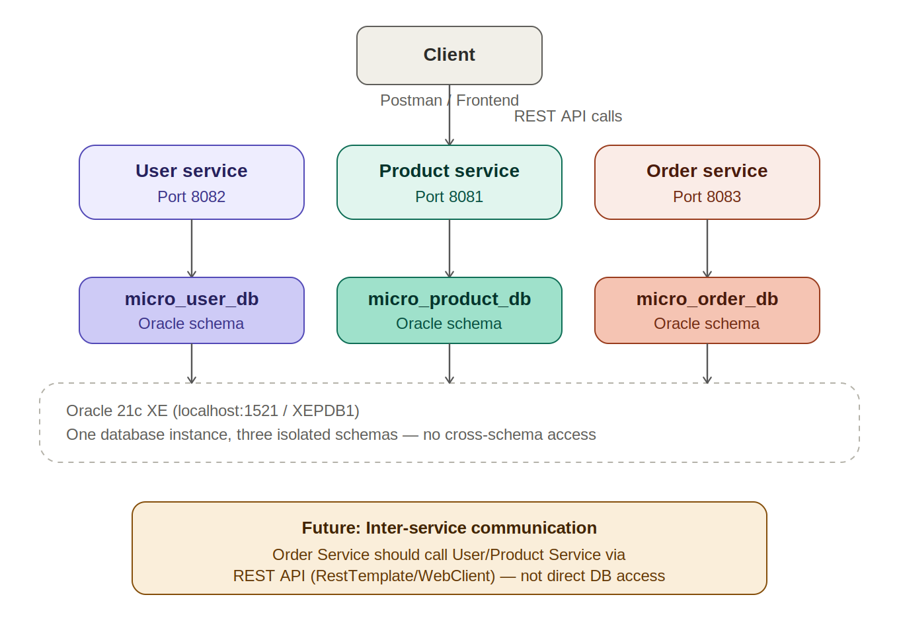
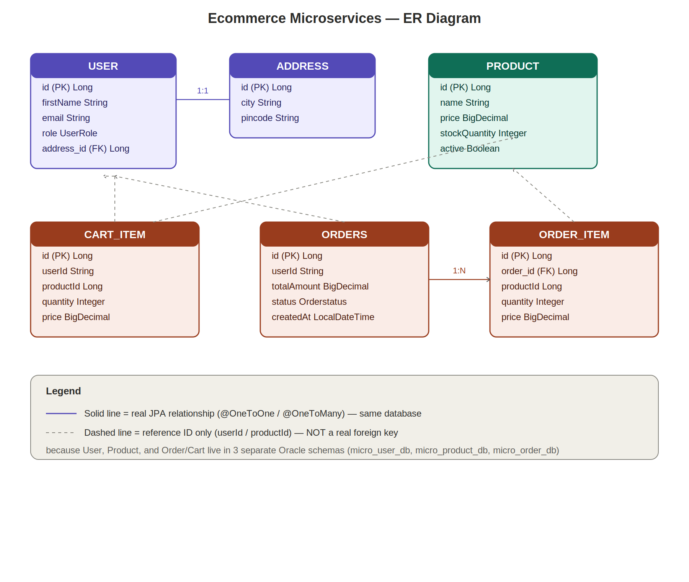

# E-Commerce Microservices Application

A Spring Boot microservices implementation of an e-commerce platform, migrated from a [monolithic e-commerce application](https://github.com/shrutipatil99/monolithic-ecommerce-application) to demonstrate service decomposition, independent deployability, and the database-per-service pattern.

## Architecture



The system is composed of three independent Spring Boot services, each with its own dedicated Oracle database schema:

| Service | Port | Database Schema | Responsibility |
|---|---|---|---|
| `user-service` | 8082 | `micro_user_db` | User profile, address & role management |
| `product-service` | 8081 | `micro_product_db` | Product catalog & inventory |
| `order-service` | 8083 | `micro_order_db` | Cart management & order placement |

Each service connects to the same Oracle 21c XE instance (`localhost:1521/XEPDB1`) but uses an isolated schema — no cross-schema database access between services.

## Entity-Relationship Diagram



Solid lines represent real JPA relationships within the same service (e.g. `User` ↔ `Address`, `Order` ↔ `OrderItem`). Dashed lines represent **reference-only IDs** (`userId`, `productId`) stored across service boundaries — not real foreign keys, since each service owns and isolates its own data.

## Tech Stack

- Java 17, Spring Boot 3.4.3
- Spring Data JPA / Hibernate
- Oracle 21c XE
- Maven (with wrapper)
- Lombok

## Project Structure
```
microservices-ecommerce-application/
├── README.md
├── .gitignore
├── docs/
│   ├── architecture-diagram.png
│   └── er-diagram.png
├── user-service/
├── product-service/
└── order-service/
```

## Running Locally

Each service is independently runnable. From inside each service folder:

```cmd
set DB_PASSWORD=your_oracle_password
mvnw spring-boot:run
```

Run all three (in separate terminals) to bring up the full system:
- `user-service` → `http://localhost:8082`
- `product-service` → `http://localhost:8081`
- `order-service` → `http://localhost:8083`

## Database Setup

Each service expects its own pre-created Oracle schema on a local Oracle 21c XE instance:
- `micro_user_db`
- `micro_product_db`
- `micro_order_db`

## Known Limitations (intentional, documented trade-offs)

- **No inter-service REST communication yet** — `order-service` does not currently call `product-service` or `user-service` over HTTP to validate stock or user existence. This is the planned next step (see "Future" note in the architecture diagram).
- **Cart pricing is currently hardcoded** instead of being fetched live from `product-service` — a direct consequence of the above limitation.